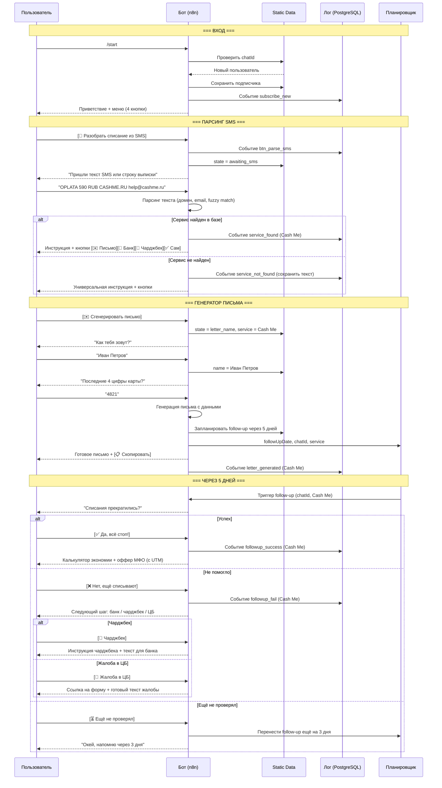

# Сценарий 1: "Жертва списания"

## Описание сегмента

**Кто это:** Пользователь увидел непонятное списание в банковском приложении или получил SMS от банка. Не понимает, откуда списание и за что. Испуган, раздражён.

**Откуда приходит:** Поиск в Telegram ("отписаться от МФО"), реклама, сарафанное радио, SEO-статьи.

**Эмоциональное состояние:** Тревога, растерянность. Хочет быстрого решения.

**Цель пользователя:** Понять что за сервис, отписаться, вернуть деньги если возможно.

**Цель бота:** Решить проблему → создать доверие → предложить оффер МФО в момент благодарности.

---

## Шаги сценария (подробно)

### Шаг 1 — Вход в бот
- Пользователь находит бот через поиск Telegram / рекламу / реферальную ссылку
- Отправляет `/start`
- Бот проверяет static data: новый пользователь
- Бот сохраняет: `chatId`, `username`, `first_name`, `subscribedAt`
- Логирует событие `subscribe_new`

**Сообщение бота:**
```
Привет, [Имя]! 👋

Я помогу разобраться с неожиданными списаниями и отписками от МФО.

С чего начнём?

[📱 Разобрать списание из SMS]
[📋 Найти сервис из списка]
[💸 Как вернуть деньги]
[✅ Надёжные МФО]
```

---

### Шаг 2 — Онбординг-выбор
- Пользователь жмёт **[📱 Разобрать списание из SMS]**
- Бот сохраняет состояние: `state = "awaiting_sms"`
- Логирует: `btn_parse_sms`

**Сообщение бота:**
```
Пришли сюда текст из SMS или строку из выписки банка.

Примеры:
• OPLATA 590 RUB CASHME.RU help@cashme.ru
• Покупка 650 руб BEZAIM.RU 8800...
• СПИСАНИЕ 399 ZAIMBERRY

Можно несколько строк сразу — разберу все 🔍
```

---

### Шаг 3 — Получение SMS / выписки
- Пользователь вставляет текст SMS или строку из выписки
- Бот получает текст, запускает парсинг

**Алгоритм парсинга:**
1. Нормализация: нижний регистр, убрать лишние пробелы
2. Поиск домена (regex: `[a-z0-9-]+\.(ru|kz|com|org)`)
3. Поиск email (regex: `[a-z0-9._%+-]+@[a-z0-9.-]+\.[a-z]+`)
4. Поиск по ключевым словам из SERVICE_LIST (fuzzy match)
5. Поиск по SERVICE_BROKER_MAP (домен → сервис)

**Ветка A: Сервис найден в базе**
→ Переход к Шагу 4A

**Ветка B: Сервис не найден**
→ Переход к Шагу 4B

---

### Шаг 4A — Сервис найден
**Сообщение бота:**
```
Нашёл! Это [Название сервиса] 🔍

💡 Как отписаться:
1. Зайди на [сайт] → Личный кабинет → Подписки
2. Нажми «Отменить подписку»
[или специфичная инструкция из базы]

📧 Email поддержки: [email если есть]

🏦 Быстрее через банк:
Тинькофф / Сбер / ВТБ → Платежи → Подписки → Найди [сервис] → Отключи

[✉️ Сгенерировать письмо]
[🏦 Инструкция для моего банка]
[💸 Как вернуть деньги (чарджбек)]
[✅ Понятно, сделаю сам]
```

---

### Шаг 4B — Сервис не найден
**Сообщение бота:**
```
Не нашёл этот сервис в базе 😔

Но вот универсальная инструкция:

1. Найди сайт сервиса → Личный кабинет → Отписаться
2. Напиши в поддержку с темой «Отмена подписки»
3. Через банк: Подписки → Найди платёж → Отключи

Хочешь — помогу составить письмо с твоими данными.

[✉️ Составить письмо]
[🏦 Через банк]
[💸 Чарджбек]
[📨 Жалоба в ЦБ]
```
- Бот логирует: `service_not_found`, сохраняет текст для пополнения базы

---

### Шаг 5 — Генератор письма (если выбрал)
- Пользователь жмёт **[✉️ Сгенерировать письмо]**
- Бот сохраняет состояние: `state = "letter_name"`, запоминает название сервиса и email

**Шаг 5.1 — Запрос имени:**
```
Как тебя зовут? (Имя Фамилия)
```

**Шаг 5.2 — Запрос номера карты:**
```
Последние 4 цифры карты, с которой было списание?
```

**Шаг 5.3 — Генерация письма:**
```
Вот письмо — скопируй и отправь на [email сервиса]:

─────────────────────────────────
Кому: [email сервиса]
Тема: Отмена подписки и возврат средств

Добрый день!

Прошу незамедлительно отменить платную подписку,
оформленную на мои данные, и вернуть списанные средства.

Данные держателя карты: [Имя Фамилия], карта *[4 цифры].
Дата последнего списания: [текущая дата - 1-3 дня].
Основание: услуга не была осознанно заказана / не использовалась.

Прошу подтвердить отмену ответным письмом в течение 3 рабочих дней.
В случае отсутствия ответа оставляю за собой право обратиться
в Центральный Банк РФ и инициировать процедуру чарджбека.

С уважением,
[Имя Фамилия]
─────────────────────────────────

[📋 Скопировать письмо]  [🏠 Главное меню]
```
- Бот планирует follow-up: сохраняет `followUpDate = now + 5 days`, `followUpService = "Название"`

---

### Шаг 6 — Инструкция по банку (если выбрал)
- Пользователь жмёт **[🏦 Инструкция для моего банка]**

**Сообщение бота:**
```
Выбери свой банк:

[Тинькофф]  [Сбербанк]
[ВТБ]       [Альфа-Банк]
[Озон Банк] [Другой банк]
```

**Для Тинькофф:**
```
🏦 Тинькофф — отключить подписку:

1. Приложение → Главная → Платежи
2. Раздел «Подписки» (или «Регулярные платежи»)
3. Найди [Название сервиса] в списке
4. Нажми → «Отключить»

Если не нашёл — чат поддержки Тинькофф:
«Прошу заблокировать регулярный платёж в пользу [сервис]»

[✅ Готово]  [❌ Не нашёл — что дальше?]
```

---

### Шаг 7 — Чарджбек (если выбрал)
- Пользователь жмёт **[💸 Как вернуть деньги (чарджбек)]**

**Сообщение бота:**
```
💸 Как вернуть деньги через чарджбек

Чарджбек — официальная процедура оспаривания платежа через банк.

Шаг 1. Обратись в поддержку банка (чат/звонок):
«Прошу инициировать процедуру чарджбека (оспаривание
карточной операции) по транзакции от [дата] на сумму [сумма]
в пользу [сервис]. Основание: несанкционированная подписка /
услуга не была оказана.»

Шаг 2. Приложи доказательства:
• Скриншот попытки отписки
• Скриншот отсутствия услуги
• Переписку с поддержкой (если была)

Шаг 3. Получи номер обращения, отслеживай статус.

Срок рассмотрения: до 30-45 дней.
Вероятность возврата: высокая при наличии доказательств.

[📋 Скопировать текст для банка]  [🏠 Главное меню]
```

---

### Шаг 8 — Follow-up (через 5 дней)
- Бот автоматически отправляет сообщение через 5 дней
- Триггер: n8n cron job проверяет static data, кому нужен follow-up

**Сообщение бота:**
```
Привет! 👋

5 дней назад разбирали [Название сервиса].
Всё получилось? Списания прекратились?

[✅ Да, всё стоп!]
[❌ Нет, ещё списывают]
[⏳ Ещё не проверял]
```

---

### Шаг 8A — Follow-up: успех
- Пользователь жмёт **[✅ Да, всё стоп!]**
- Бот логирует: `followup_success`, `service = "Название"`

**Сообщение бота:**
```
Отлично! Рад помочь 🎉

Ты сэкономил ~[сумма]/мес = [сумма × 12] руб/год 💰

─── Партнёрский блок ───────────────
Если в будущем понадобится займ —
вот МФО без скрытых подписок:

• Займер — до 30 000 руб, прозрачные условия
  [Получить займ →]

• Екапуста — первый займ бесплатно
  [Получить займ →]

Это проверенные партнёры ✅
────────────────────────────────────

[🏠 Главное меню]
```

---

### Шаг 8B — Follow-up: не помогло
- Пользователь жмёт **[❌ Нет, ещё списывают]**

**Сообщение бота:**
```
Жаль, что не получилось с первого раза.
Попробуем следующий шаг:

[🏦 Заблокировать через банк]
[💸 Оспорить через чарджбек]
[📨 Пожаловаться в ЦБ РФ]
[📨 Жалоба в Роспотребнадзор]
```

---

### Шаг 9 — Жалоба в ЦБ
**Сообщение бота:**
```
📨 Жалоба в Центральный Банк РФ

Форма подачи: cbr.ru → «Интернет-приёмная» → МФО/кредиторы

Текст жалобы:
─────────────────────────────────
[Название МФО/сервиса] производит несанкционированные списания
с банковской карты *[4 цифры] без моего согласия.
Попытки самостоятельно отписаться не принесли результата.
Прошу провести проверку и обязать сервис прекратить списания
и вернуть неправомерно взысканные средства.
─────────────────────────────────

[📋 Скопировать текст]

Срок рассмотрения: 30 дней.
Результат: предписание ЦБ + штраф для МФО.

[🏠 Главное меню]
```

---

## Диаграмма последовательности



---

## Ключевые метрики сценария

| Метрика | Цель |
|---------|------|
| Конверсия /start → парсинг SMS | > 60% |
| Сервис найден в базе | > 70% |
| Конверсия → генератор письма | > 30% |
| Follow-up: ответили | > 40% |
| Follow-up: успех | > 50% из ответивших |
| Клик по офферу МФО | > 15% успешных |

---

## Что нужно реализовать

| Компонент | Статус | Описание |
|-----------|--------|----------|
| Онбординг-меню при /start | ❌ нет | 4 кнопки вместо текущего меню |
| Пакетный парсинг (несколько строк) | ❌ нет | Найти все сервисы в одном тексте |
| Генератор письма | ❌ нет | Запрос имени + карты → шаблон |
| Инструкции по банкам | ❌ нет | Тинькофф/Сбер/ВТБ/Альфа |
| Планировщик follow-up | ❌ нет | Сохранить дату в static data, cron проверяет |
| Калькулятор экономии | ❌ нет | Сумма × 12 после успешного follow-up |
| Оффер МФО после успеха | ❌ нет | UTM-ссылки, показывать 1 раз |
| Жалоба в ЦБ — готовый текст | ❌ нет | Шаблон + ссылка cbr.ru |
