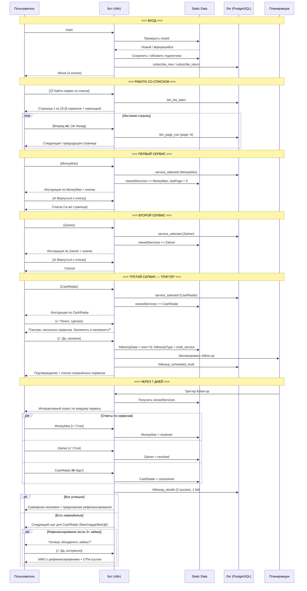

# Сценарий 2: "Должник в яме"

## Описание сегмента

**Кто это:** Пользователь, который взял займы в нескольких МФО. Помимо основного долга, сервисы автоматически подключили доп. платные услуги: "Страховка", "СМС-информирование", "Защита платежей", "VIP-статус" и т.д. Хочет найти и отключить всё лишнее, чтобы снизить ежемесячные расходы.

**Откуда приходит:** Поиск "как отписаться от Moneyman", "отключить страховку в МФО", по совету знакомых.

**Эмоциональное состояние:** Финансовый стресс, перегружен, хочет системного решения, а не разового.

**Цель пользователя:** Последовательно отписаться от всех ненужных платных услуг в нескольких МФО.

**Цель бота:** Провести через несколько сервисов, запомнить, сделать follow-up по каждому → показать результат как "сэкономил Х руб/мес".

---

## Шаги сценария (подробно)

### Шаг 1 — Вход в бот
- Пользователь отправляет `/start`
- Бот проверяет static data: новый или возвращающийся
- Для нового: сохраняет данные, логирует `subscribe_new`
- Для возвращающегося: логирует `subscribe_return`

**Сообщение бота (новый пользователь):**
```
Привет, [Имя]! 👋

Я помогу разобраться с подписками МФО и лишними платежами.

С чего начнём?

[📱 Разобрать списание из SMS]
[📋 Найти сервис из списка]
[💸 Как вернуть деньги]
[✅ Надёжные МФО]
```

---

### Шаг 2 — Переход к списку сервисов
- Пользователь жмёт **[📋 Найти сервис из списка]**
- Бот формирует страницу 1 из N (8 сервисов на странице)
- Логирует: `btn_list_open`

**Сообщение бота:**
```
Выбери сервис из списка ⬇️
Страница 1 из 18

[1xmoneys]      [5 копеек]
[Aazaim]        [Alt-Credit]
[Avia finances] [Beri credit]
[Beribistro]    [Besplatno zaim]

[⬅️ Назад]  [Вперёд ➡️]  [❌ Закрыть]
```

---

### Шаг 3 — Поиск и выбор первого сервиса
- Пользователь листает страницы (логирует `btn_page_nav`)
- Находит нужный сервис, жмёт на кнопку (логирует `service_selected`)

**Сообщение бота:**
```
MoneyMan — как отписаться от доп. услуг:

📋 Через личный кабинет:
1. Войди на moneyman.ru → Личный кабинет
2. Раздел «Мои услуги» или «Подписки»
3. Отключи:
   • «Защита платежей» (от 149 руб/мес)
   • «СМС-информирование» (от 99 руб/мес)
   • «VIP-сервис» (если подключён)

📧 Email: support@moneyman.ru

🏦 Быстрее через банк:
Найди платёж MoneyMan в разделе «Подписки» и отключи.

[✅ Понял, сделаю]
[✉️ Составить письмо]
[🔙 Вернуться к списку]
```

---

### Шаг 4 — Возврат к списку
- Пользователь жмёт **[🔙 Вернуться к списку]**
- Бот сохраняет `lastPage` — возвращает на ту же страницу
- Бот сохраняет в истории: `viewedServices = ["MoneyMan"]`

---

### Шаг 5 — Второй и третий сервис (повторение)
- Пользователь снова листает, находит следующий сервис
- Выбирает Zaimer → получает инструкцию → возвращается к списку
- Выбирает CashRadar → получает инструкцию

**После 3-го просмотренного сервиса бот отправляет триггерное сообщение:**
```
Смотрю, у тебя несколько сервисов 🔍

Разобрали уже: MoneyMan, Zaimer, CashRadar.

Хочешь — запомню список и напишу через 7 дней,
чтобы проверить — прекратились ли все списания?

[✅ Да, запомни и напомни]
[Нет, спасибо]
```

---

### Шаг 6 — Сохранение истории и планирование follow-up
- Пользователь жмёт **[✅ Да, запомни и напомни]**
- Бот сохраняет в static data:
  ```
  viewedServices: ["MoneyMan", "Zaimer", "CashRadar"],
  followUpDate: now + 7 days,
  followUpType: "multi_service"
  ```
- Логирует: `followup_scheduled_multi`

**Сообщение бота:**
```
Запомнил! 📝

Сохранил:
• MoneyMan
• Zaimer
• CashRadar

Напишу через 7 дней — проверим все три.

Пока можешь продолжить листать список, если есть ещё сервисы.

[📋 Продолжить список]  [🏠 Главное меню]
```

---

### Шаг 7 — Кнопка "Мои сервисы"
- Пользователь может в любой момент вернуться к своей истории

**Сообщение бота:**
```
📋 Твои сервисы

Ты разбирал:
• MoneyMan — просмотрено [дата]
• Zaimer — просмотрено [дата]
• CashRadar — просмотрено [дата]

Follow-up запланирован: [дата через 7 дней]

[🔁 Открыть инструкцию ещё раз]  [🏠 Главное меню]
```

---

### Шаг 8 — Follow-up через 7 дней
- n8n cron job проверяет всех с `followUpType = "multi_service"` и `followUpDate <= now`
- Отправляет интерактивный опрос

**Сообщение бота:**
```
Привет! Прошла неделя.
Проверь — прекратились ли списания?

MoneyMan:   [✅ Стоп]  [❌ Идут]
Zaimer:     [✅ Стоп]  [❌ Идут]
CashRadar:  [✅ Стоп]  [❌ Идут]
```

---

### Шаг 9A — Все успешно
- Пользователь отмечает все как ✅
- Бот суммирует экономию

**Сообщение бота:**
```
Превосходно! Все сервисы отключены 🎉

Твоя экономия:
• MoneyMan: ~248 руб/мес
• Zaimer: ~199 руб/мес
• CashRadar: ~149 руб/мес

Итого: ~596 руб/мес = 7 152 руб/год 💰

Хочешь разобрать ещё сервисы?

[📋 Продолжить список]  [🏠 Меню]
```

---

### Шаг 9B — Частично / не помогло (по отдельным сервисам)
- Пользователь отмечает CashRadar как ❌

**Сообщение бота (по каждому проблемному):**
```
CashRadar — ещё идут списания. Попробуем следующий шаг:

[🏦 Заблокировать через банк]
[💸 Оспорить (чарджбек)]
[📨 Пожаловаться в ЦБ]
[✉️ Написать в поддержку ещё раз]
```

---

### Шаг 10 — Предложение рефинансирования (опционально)
Если пользователь успешно закрыл 3+ сервиса и явно имеет несколько займов:

**Сообщение бота:**
```
Кстати, если у тебя несколько займов в разных МФО —
их можно объединить в один по более низкой ставке.

Это называется рефинансирование.

Хочешь узнать, какие МФО делают рефинансирование?
[✅ Да, интересно]  [Нет, спасибо]
```

**При согласии:**
```
МФО с рефинансированием займов:

1️⃣ Займер — рефинансирование до 30 000 руб
   [Узнать условия →]

2️⃣ Мани Мен — объединение займов
   [Узнать условия →]
```

---

## Диаграмма последовательности



---

## Ключевые метрики сценария

| Метрика | Цель |
|---------|------|
| Конверсия → список сервисов | > 50% |
| Среднее кол-во просмотренных сервисов | > 2 |
| Согласие на follow-up | > 55% |
| Follow-up: ответили | > 40% |
| Полное решение (все ✅) | > 45% из ответивших |
| Клик на рефинансирование | > 20% при показе |

---

## Что нужно реализовать

| Компонент | Статус | Описание |
|-----------|--------|----------|
| Счётчик просмотренных сервисов | ❌ нет | После 3-го — триггерное сообщение |
| История сервисов в static data | ❌ нет | `viewedServices[]` массив |
| Кнопка "Мои сервисы" | ❌ нет | Показывать историю с датами |
| Возврат на ту же страницу списка | ⚠️ частично | Сохранять `lastPage` |
| Планировщик multi-service follow-up | ❌ нет | `followUpType = multi_service` |
| Интерактивный опрос по нескольким сервисам | ❌ нет | Кнопки ✅/❌ для каждого |
| Калькулятор суммарной экономии | ❌ нет | Сложить суммы по всем сервисам |
| Блок рефинансирования | ❌ нет | Показывать при 3+ займах |
