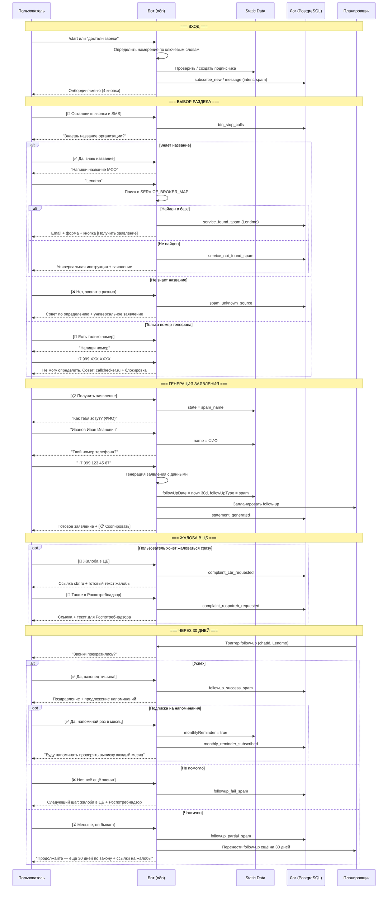

# Сценарий 3: "Спам-жертва"

## Описание сегмента

**Кто это:** Человек, которому постоянно звонят и/или присылают SMS с предложениями займов. Возможно, когда-то оставил данные на одном сайте, и они "утекли" в базы МФО. Или брал займ, и теперь получает агрессивный маркетинг. Займов не хочет, контакт воспринимает как преследование.

**Откуда приходит:** Поиск "как остановить звонки от МФО", "убрать из базы МФО", "как отписаться от SMS займы".

**Эмоциональное состояние:** Злость, усталость, ощущение беспомощности. Хочет чтобы просто оставили в покое.

**Цель пользователя:** Полностью прекратить любые коммуникации от конкретного МФО или всех МФО.

**Цель бота:** Дать реально работающий инструмент (заявление об отзыве данных + жалоба в ЦБ) → удержать пользователя полезным контентом о финансовой безопасности.

**Важно:** Этому сегменту НЕ показывать рекламу займов. Вызовет немедленную блокировку.

---

## Шаги сценария (подробно)

### Шаг 1 — Вход в бот
- Пользователь отправляет `/start` или пишет свободный текст: "помогите", "достали звонки", "как остановить"
- Бот определяет намерение по ключевым словам: "звонок", "звонят", "SMS", "пишут", "достали", "надоели"

**Сообщение бота:**
```
Привет! 👋

Я помогу разобраться с подписками и нежелательными контактами от МФО.

С чем пришёл?

[📱 Разобрать непонятное списание]
[📵 Остановить звонки и SMS от МФО]
[📋 Найти и отписаться от сервиса]
[✅ Найти надёжный займ]
```

---

### Шаг 2 — Выбор раздела "Остановить звонки"
- Пользователь жмёт **[📵 Остановить звонки и SMS от МФО]**
- Логирует: `btn_stop_calls`

**Сообщение бота:**
```
Понял — нужно остановить звонки и SMS от МФО.

Знаешь название организации, которая звонит?

[✅ Да, знаю название]
[❌ Нет, звонят с разных номеров]
[📱 Есть только номер телефона]
```

---

### Шаг 3A — Знает название организации
- Пользователь жмёт **[✅ Да, знаю название]**

**Сообщение бота:**
```
Напиши название МФО или сервиса — найду контакты и инструкцию.
```

- Пользователь пишет: "Lendmo" (или любое другое)
- Бот ищет в SERVICE_LIST / SERVICE_BROKER_MAP

**Если найден:**
```
Lendmo — как остановить звонки и SMS:

📧 Email для отзыва данных: support@lendmo.ru
🌐 Форма на сайте: lendmo.ru/contacts

📋 Тема письма: «Отзыв согласия на обработку персональных данных»

Вот готовое заявление — отправь на указанный email:
[📋 Получить заявление]

⏱ По закону обязаны ответить в течение 30 дней.

[📋 Получить заявление]
[📨 Жалоба в ЦБ (если не помогло)]
[📨 Жалоба в Роспотребнадзор]
```

**Если не найден:**
```
Не нашёл [X] в базе.

Но инструкция универсальна — подходит для любого МФО:
[📋 Получить универсальное заявление]
```

---

### Шаг 3B — Не знает название
- Пользователь жмёт **[❌ Нет, звонят с разных номеров]**

**Сообщение бота:**
```
Это сложнее — скорее всего, твои данные попали в несколько баз.

Вот что делать:

1️⃣ Включи определитель номеров (GetContact, Яндекс) —
   узнаешь кто звонит

2️⃣ Для каждого МФО подай заявление об отзыве данных

3️⃣ Если звонки продолжаются — жалоба в ЦБ и Роспотребнадзор

Могу сразу дать универсальное заявление для любого МФО:
[📋 Получить универсальное заявление]
[📨 Жалоба в ЦБ сразу на всех]
```

---

### Шаг 3C — Есть только номер телефона
- Пользователь жмёт **[📱 Есть только номер телефона]**

**Сообщение бота:**
```
Напиши номер телефона, с которого звонят.
```

- Пользователь пишет номер
- Бот не может найти организацию по номеру (нет API), но:

**Сообщение бота:**
```
По номеру [номер] не могу точно определить МФО без специального сервиса.

Что можно сделать:

🔍 Определить организацию:
   • Введи номер на сайте: callchecker.ru или numbuster.ru
   • Или используй приложение GetContact

📵 Заблокировать номер:
   • Android: Телефон → Инфо о контакте → Заблокировать
   • iPhone: Телефон → Последние → (i) → Заблокировать

Когда узнаешь название МФО — вернись, помогу с заявлением.

[📋 Универсальное заявление без названия]
[🏠 Главное меню]
```

---

### Шаг 4 — Генератор заявления об отзыве данных
- Пользователь жмёт **[📋 Получить заявление]** или **[📋 Получить универсальное заявление]**
- Бот сохраняет состояние: `state = "spam_name"`

**Шаг 4.1 — Запрос имени:**
```
Как тебя зовут? (Имя Отчество Фамилия — полностью)
```

**Шаг 4.2 — Запрос телефона:**
```
Твой номер телефона (на который звонят)?
```

**Шаг 4.3 — Генерация заявления:**
```
Вот заявление — скопируй и отправь на email [МФО]:

─────────────────────────────────
Кому: [email МФО или support@мфо.ru]
Тема: Отзыв согласия на обработку персональных данных

Генеральному директору [Название МФО]
от [Фамилия Имя Отчество], тел. [номер]

ЗАЯВЛЕНИЕ

На основании ст. 9 Федерального закона № 152-ФЗ
«О персональных данных» отзываю своё согласие на обработку,
хранение и передачу моих персональных данных.

Прошу:
1. Удалить мои данные из всех баз и реестров.
2. Прекратить любые коммуникации (звонки, SMS, email).
3. Не передавать мои данные третьим лицам.
4. Направить письменное подтверждение исполнения
   в течение 30 дней с момента получения заявления.

В случае невыполнения оставляю за собой право обратиться
в Роспотребнадзор и Центральный Банк РФ.

[Фамилия Имя Отчество]
Дата: [текущая дата]
─────────────────────────────────

[📋 Скопировать заявление]

Сохраню напоминание — напишу через 30 дней, проверим результат.
```

- Бот планирует follow-up: `followUpDate = now + 30 days`, `followUpType = spam`

---

### Шаг 5 — Жалоба в ЦБ
- Пользователь жмёт **[📨 Жалоба в ЦБ]**

**Сообщение бота:**
```
📨 Жалоба в Центральный Банк РФ

Центральный Банк контролирует все МФО.
Жалоба туда — самый эффективный инструмент.

🔗 Как подать:
   1. cbr.ru → «Интернет-приёмная»
   2. Раздел: МФО / Кредиторы
   3. Тема: Нарушение закона о рекламе / персональных данных

📋 Текст жалобы:
─────────────────────────────────
[Название МФО] осуществляет навязчивые звонки и SMS-рассылку
с предложениями займов после моего отказа от получения
каких-либо услуг и отзыва согласия на обработку данных.

Данные действия нарушают:
— ФЗ № 152 «О персональных данных»
— ФЗ № 38 «О рекламе» (ст. 18)

Прошу провести проверку и обязать МФО прекратить
нежелательные коммуникации.
─────────────────────────────────

[📋 Скопировать текст]

⏱ Срок рассмотрения: 30 дней.
💰 Результат: предписание + штраф для МФО до 500 000 руб.

[📨 Также подать в Роспотребнадзор]  [🏠 Главное меню]
```

---

### Шаг 6 — Жалоба в Роспотребнадзор
- Пользователь жмёт **[📨 Жалоба в Роспотребнадзор]**

**Сообщение бота:**
```
📨 Жалоба в Роспотребнадзор

Роспотребнадзор принимает жалобы на спам-звонки и нарушение
закона о рекламе.

🔗 Как подать:
   1. petition.rospotrebnadzor.ru
   2. Или через Госуслуги → Жалоба на организацию

📋 Текст жалобы:
─────────────────────────────────
[Название МФО / номер телефона] систематически
осуществляет нежелательные звонки и SMS с рекламой займов.
Согласие на получение рекламы не давалось.
Требую прекратить рекламные рассылки.
Основание: ФЗ № 38 «О рекламе», ст. 18.
─────────────────────────────────

[📋 Скопировать текст]  [🏠 Главное меню]
```

---

### Шаг 7 — Follow-up через 30 дней
- n8n cron job проверяет всех с `followUpType = spam` и `followUpDate <= now`

**Сообщение бота:**
```
Привет! Прошёл месяц.

Помнишь, разбирали звонки от [МФО].
Прекратились?

[✅ Да, наконец-то тишина!]
[❌ Нет, всё ещё звонят]
[⏳ Меньше, но ещё бывает]
```

---

### Шаг 7A — Успех
**Сообщение бота:**
```
Отлично, закон работает! 🎉

Если появятся другие нежелательные звонки или списания —
возвращайся, разберём.

💡 Совет: раз в месяц проверяй выписку банка на предмет
новых подписок. Хочешь, буду напоминать?

[✅ Да, напоминай раз в месяц]  [Нет, спасибо]
```

---

### Шаг 7B — Не помогло
**Сообщение бота:**
```
Жаль — некоторые МФО игнорируют заявления.

Следующий шаг — подать жалобу сразу в оба ведомства:

[📨 Жалоба в ЦБ — текст готов]
[📨 Жалоба в Роспотребнадзор — текст готов]

После этого МФО обязаны ответить в течение 30 дней
или получат штраф до 500 000 руб.
```

---

## Диаграмма последовательности



---

## Ключевые метрики сценария

| Метрика | Цель |
|---------|------|
| Конверсия /start → "Остановить звонки" | > 40% для этого сегмента |
| Конверсия → получение заявления | > 60% |
| Отправка жалобы в ЦБ | > 25% |
| Follow-up: ответили | > 35% |
| Успешное решение | > 45% из ответивших |
| Подписка на напоминания | > 30% успешных |

---

## Что нужно реализовать

| Компонент | Статус | Описание |
|-----------|--------|----------|
| Определение намерения по тексту | ❌ нет | Ключевые слова: "звонки", "SMS", "достали" |
| Раздел "Остановить звонки/SMS" | ❌ нет | Новый пункт меню |
| Генератор заявления об отзыве данных | ❌ нет | ФИО + телефон → заявление по 152-ФЗ |
| Жалоба в ЦБ — готовый текст | ❌ нет | Шаблон + ссылка cbr.ru/reception |
| Жалоба в Роспотребнадзор — текст | ❌ нет | Шаблон + ссылка |
| Follow-up через 30 дней | ❌ нет | Тип: spam, дата +30 |
| Подписка на ежемесячные напоминания | ❌ нет | `monthlyReminder = true` в static data |
| Флаг "не показывать рекламу МФО" | ❌ нет | `noMFOAds = true` для этого сегмента |
