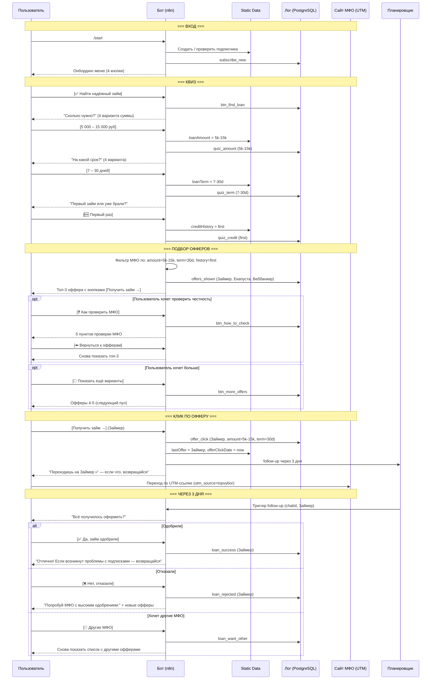

# Сценарий 4: "Искатель займа"

## Описание сегмента

**Кто это:** Человеку нужны деньги прямо сейчас. Он слышал о мошеннических МФО, боится попасть на скрытые комиссии или бесконечные подписки. Ищет надёжный вариант с понятными условиями.

**Откуда приходит:** Поиск "надёжное МФО без подписок", "МФО без скрытых платежей", реклама бота, раздел "Надёжные МФО" (уже есть в боте).

**Эмоциональное состояние:** Тревога (не хочет попасть на мошенников), срочность (нужно быстро), надежда.

**Цель пользователя:** Получить займ у проверенного МФО на понятных условиях.

**Цель бота:** Провести через квиз → показать релевантные офферы с UTM-ссылками → получить комиссию при оформлении.

**Это самый ценный сегмент для монетизации** — пользователь готов оформить займ прямо сейчас.

---

## Шаги сценария (подробно)

### Шаг 1 — Вход в бот
- Пользователь приходит из рекламы / поиска / рекомендации
- Отправляет `/start`

**Сообщение бота:**
```
Привет! 👋

Я помогу найти надёжное МФО без скрытых подписок
и разобраться с проблемными сервисами.

С чего начнём?

[✅ Найти надёжный займ]
[📱 Разобрать непонятное списание]
[📋 Найти и отписаться от сервиса]
[📵 Остановить звонки от МФО]
```

---

### Шаг 2 — Выбор "Найти надёжный займ"
- Пользователь жмёт **[✅ Найти надёжный займ]**
- Логирует: `btn_find_loan`

**Сообщение бота:**
```
Подберём надёжный займ под твои условия.

Сколько нужно? 💰

[до 5 000 руб]
[5 000 – 15 000 руб]
[15 000 – 50 000 руб]
[более 50 000 руб]
```

---

### Шаг 3 — Квиз: сумма
- Пользователь выбирает сумму
- Бот сохраняет: `loanAmount = "5k-15k"`, логирует `quiz_amount`

**Сообщение бота:**
```
На какой срок нужен займ? 📅

[до 7 дней]
[7 – 30 дней]
[1 – 3 месяца]
[более 3 месяцев]
```

---

### Шаг 4 — Квиз: срок
- Пользователь выбирает срок
- Бот сохраняет: `loanTerm = "7-30"`, логирует `quiz_term`

**Сообщение бота:**
```
Это первый займ в МФО или уже брали раньше?

[🆕 Первый раз]
[↩️ Уже брал(а) — хорошая история]
[⚠️ Брал(а), были просрочки]
```

---

### Шаг 5 — Квиз: кредитная история
- Бот сохраняет: `creditHistory = "first" / "good" / "bad"`
- Это влияет на показываемые офферы (например, при плохой истории — МФО лояльные к просрочкам)

---

### Шаг 6 — Выдача подобранных офферов

**Вариант A: Первый займ, 5-15к, 7-30 дней:**
```
✅ Топ-3 займа для тебя

Подобрал под твои параметры:
сумма 5–15 000 руб · срок до 30 дней · первый займ

─────────────────────────────────
1️⃣ Займер
   До 30 000 руб · до 30 дней
   ⭐ Первый займ под 0%
   ✅ Без скрытых подписок
   ⚡ Одобрение за 5 минут, онлайн
   [Получить займ →]
─────────────────────────────────
2️⃣ Екапуста
   До 30 000 руб · до 21 дня
   ⭐ Первый займ бесплатно
   ✅ Лицензия ЦБ РФ
   ⚡ Только паспорт, без справок
   [Получить займ →]
─────────────────────────────────
3️⃣ Веббанкир
   До 30 000 руб · до 30 дней
   Ставка: от 0% (акция для новых)
   ✅ Работает с 2011 года
   ⚡ Одобрение 24/7
   [Получить займ →]
─────────────────────────────────

[🔄 Показать ещё варианты]
[❓ Как проверить МФО на честность]
[🏠 Главное меню]
```

**Вариант B: Плохая кредитная история:**
```
✅ МФО, которые работают с плохой историей

─────────────────────────────────
1️⃣ Турбозайм
   До 15 000 руб · до 30 дней
   ✅ Одобрение даже при просрочках
   ✅ Помогает восстановить КИ
   [Получить займ →]
─────────────────────────────────
2️⃣ Финтерра
   До 10 000 руб
   ✅ Без проверки БКИ
   ⚡ Деньги за 15 минут
   [Получить займ →]
─────────────────────────────────
```

---

### Шаг 7 — "Как проверить МФО на честность"
- Пользователь жмёт **[❓ Как проверить МФО на честность]**

**Сообщение бота:**
```
⚠️ Как не попасть на мошенников

Перед оформлением займа проверь 5 вещей:

1️⃣ Лицензия ЦБ РФ
   Проверь на cbr.ru → «Проверить организацию»
   Без лицензии — это нелегальный кредитор.

2️⃣ Никаких предоплат
   Настоящий МФО НИКОГДА не просит деньги вперёд.
   «Страховка», «верификация» до выдачи — мошенники.

3️⃣ Прозрачный договор
   Прочитай ПСК (полная стоимость кредита).
   Должно быть указано крупным шрифтом на первой странице.

4️⃣ Нет скрытых подписок
   Прочитай что подписываешь — ищи галочки с подписками.
   Их можно снять перед подтверждением.

5️⃣ Реальные отзывы
   Проверь на Banki.ru → раздел МФО.

Все МФО в нашем списке выше прошли эти проверки ✅

[⬅️ Вернуться к офферам]  [🏠 Главное меню]
```

---

### Шаг 8 — Показать ещё варианты
- Пользователь жмёт **[🔄 Показать ещё варианты]**
- Бот показывает следующие 3 МФО из пула

```
📋 Ещё варианты

─────────────────────────────────
4️⃣ Мани Мен
   До 70 000 руб · до 60 дней
   ✅ Работает с 2011 года
   Ставка: от 0,5% в день
   [Получить займ →]
─────────────────────────────────
5️⃣ Лайм-Займ
   До 100 000 руб · до 168 дней
   ✅ Лицензия ЦБ, крупный игрок
   Есть рассрочка
   [Получить займ →]
─────────────────────────────────

[⬅️ Назад к первым]  [🏠 Главное меню]
```

---

### Шаг 9 — Клик по офферу (UTM-переход)
- Пользователь жмёт **[Получить займ →]** для одного из МФО
- Бот логирует: `offer_click (МФО, chatId, amount, term)`
- Переход по UTM-ссылке: `https://zaimer.ru/?utm_source=topvybor&utm_medium=tgbot&utm_campaign=loan_quiz&utm_content=zaimer`

**Сообщение бота (после клика):**
```
Переходишь на сайт Займер ✅

Если возникнут вопросы или что-то не понравится —
возвращайся, подберём другой вариант.

Удачи с займом! 💪

[⬅️ Другие МФО]  [🏠 Главное меню]
```

---

### Шаг 10 — Follow-up через 3 дня (опционально)
- Если пользователь кликнул на оффер но больше не возвращался

**Сообщение бота:**
```
Привет! 3 дня назад смотрел займы в Займер.
Всё получилось оформить?

[✅ Да, займ одобрили]
[❌ Нет, отказали]
[⏳ Ещё не оформлял]
[🔄 Хочу посмотреть другие МФО]
```

**При отказе:**
```
Жаль! Попробуй другие варианты —
они лояльнее к разным ситуациям:

[Посмотреть МФО с высоким одобрением]
```

---

## Диаграмма последовательности



---

## Ключевые метрики сценария

| Метрика | Цель |
|---------|------|
| Конверсия /start → квиз | > 30% |
| Завершение квиза | > 75% начавших |
| Конверсия квиз → клик на оффер | > 40% |
| Follow-up: ответили | > 30% |
| Одобрение займа (из ответивших) | > 50% |

---

## Что нужно реализовать

| Компонент | Статус | Описание |
|-----------|--------|----------|
| Кнопка "Найти надёжный займ" в меню | ⚠️ частично | Сейчас есть "Надёжные МФО" без квиза |
| Квиз: сумма → срок → кредитная история | ❌ нет | 3 шага, callback-кнопки |
| Матрица МФО × параметры | ❌ нет | Фильтрация офферов по ответам квиза |
| UTM-ссылки для каждого МФО | ❌ нет | utm_source=topvybor&utm_content=mfo_name |
| Логирование offer_click с параметрами | ❌ нет | chatId + МФО + amount + term |
| Раздел "Как проверить МФО" | ❌ нет | 5 пунктов проверки |
| Follow-up через 3 дня после клика | ❌ нет | followUpType = loan_click |
| Показ "ещё вариантов" (пагинация офферов) | ❌ нет | Кнопка "Показать ещё" |
| Специальный пул МФО для плохой КИ | ❌ нет | creditHistory = bad → другие МФО |
