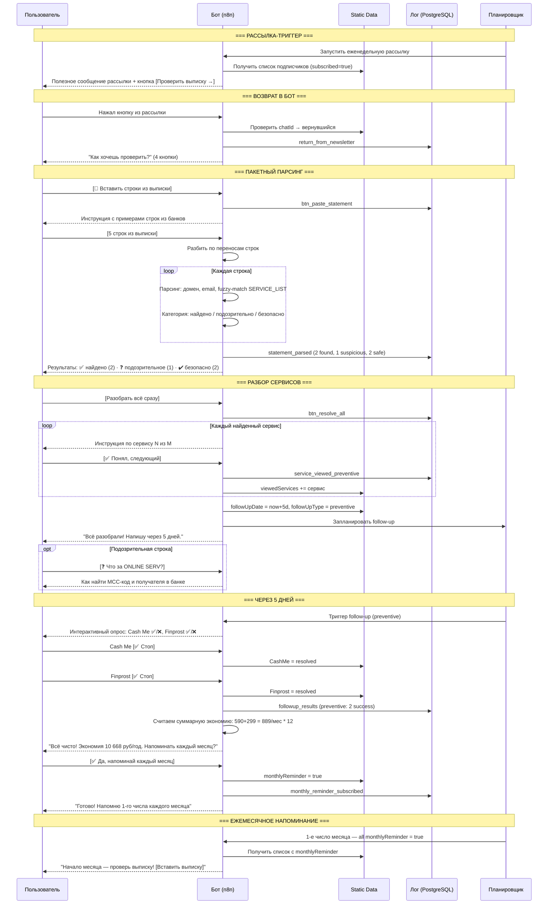

# Сценарий 5: "Профилактик"

## Описание сегмента

**Кто это:** Финансово грамотный пользователь. Слышал о мошеннических подписках, хочет периодически проверять свою выписку. Активно пользуется банковским приложением, следит за расходами. Возможно, уже использовал бота раньше для конкретной проблемы.

**Откуда приходит:** Еженедельная/ежемесячная рассылка бота, напоминание, или возвращается сам проверить.

**Эмоциональное состояние:** Спокойный, проактивный. Не в стрессе — делает профилактику.

**Цель пользователя:** Быстро проверить нет ли лишних подписок, получить подтверждение "всё чисто" или немедленно разобраться с проблемой.

**Цель бота:** Стать регулярным инструментом в жизни → максимальное удержание → нативные партнёрские рекомендации МФО.

---

## Шаги сценария (подробно)

### Шаг 0 — Триггер: полезная рассылка
- Бот отправляет еженедельную рассылку с реальной ценностью (не пустой пинг)

**Примеры рассылок:**
```
[Пример 1 — сезонное предупреждение]
🚨 Март — пик мошеннических подписок

По статистике, в конце квартала резко растёт число
скрытых списаний от МФО-сервисов.

Проверь выписку прямо сейчас — это займёт 2 минуты.
[Проверить выписку →]

──────────────────
[Пример 2 — новые сервисы]
📊 На этой неделе добавили в базу:
• CashFlow Pro (новый)
• Zaim Online (обновлена инструкция)
• MoneyFast kz

Всего в базе: 147 сервисов.
[Проверить свои подписки →]

──────────────────
[Пример 3 — схема мошенников]
⚠️ Популярная схема этой недели

МФО подключают «защиту платежей» при оформлении займа,
не спрашивая явного согласия. Сумма: 149–299 руб/мес.

Если ты когда-либо брал займ — проверь:
[Проверить подписки →]

──────────────────
[Пример 4 — партнёрский блок, раз в 2 недели]
💡 Совет недели

Если нужен займ — выбирай МФО с прозрачными условиями.
Вот 3 проверенных партнёра без скрытых подписок:

• Займер — 0% первый займ [Узнать →]
• Екапуста — только паспорт [Узнать →]
• Мани Мен — до 70 000 руб [Узнать →]
```

---

### Шаг 1 — Пользователь возвращается в бот
- Пользователь жмёт кнопку из рассылки или открывает бот сам
- Бот определяет: это возвращающийся пользователь
- Логирует: `subscribe_return` или `return_from_newsletter`

**Сообщение бота:**
```
Привет, [Имя]! 👋

Как хочешь проверить сегодня?

[📱 Вставить строки из выписки банка]
[📋 Просмотреть список сервисов]
[🔍 Найти конкретный сервис]
[📚 Мои прошлые сервисы]
```

---

### Шаг 2 — Выбор: вставить выписку
- Пользователь жмёт **[📱 Вставить строки из выписки банка]**
- Логирует: `btn_paste_statement`

**Сообщение бота:**
```
Вставь несколько строк из банковской выписки —
найду подозрительные и знакомые сервисы.

Примеры строк из разных банков:

Тинькофф:
19.03 CASHME.RU -590,00 ₽

Сбербанк:
19.03.2025 Покупка 590.00 CASHME RU

ВТБ:
03/19 PURCHASE ZAIMBERRY 399 RUB

Можно вставить сразу несколько строк одним сообщением 📋
```

---

### Шаг 3 — Получение и пакетный парсинг выписки
- Пользователь вставляет 3-7 строк из выписки
- Бот парсит каждую строку:
  1. Разбивает по переносам строк
  2. Для каждой строки: поиск домена, email, fuzzy-match по SERVICE_LIST
  3. Категоризация: найдено / не найдено / подозрительно

**Результат (пример):**
```
Проверил 5 строк:

✅ Найдено в базе:
• Cash Me — 590 руб (умеем отписывать)
• Finprost — 299 руб (умеем отписывать)

❓ Подозрительное (не в базе):
• ONLINE SERV 149 — не знаем что это

✔️ Безопасные (не МФО):
• ЯНДЕКС.ПЛЮС — это обычный сервис
• SPOTIFY — это обычный сервис

Разобрать найденные?

[Cash Me]  [Finprost]  [Разобрать всё сразу]
[❓ Что за ONLINE SERV?]
```

---

### Шаг 4 — Разобрать всё сразу
- Пользователь жмёт **[Разобрать всё сразу]**
- Бот последовательно выдаёт инструкции

**Сообщение бота:**
```
Разбираем по очереди 📋

━━━━ 1 из 2: Cash Me ━━━━

💡 Как отписаться:
1. cashme.ru → Личный кабинет → Подписки → Отменить
2. Или email: help@cashme.ru

🏦 Через банк: найди Cash Me в подписках и отключи

[✅ Понял, следующий]  [✉️ Письмо]  [🏦 Банк]
```

- После нажатия **[✅ Понял, следующий]**:
```
━━━━ 2 из 2: Finprost ━━━━

💡 Как отписаться:
1. finprost.ru → ЛК → Дополнительные услуги
2. Email: support@finprost.ru

[✅ Понял, это всё]  [✉️ Письмо]  [🏦 Банк]
```

- После последнего:
```
Всё разобрали! ✅

Сохранил: Cash Me, Finprost.
Напишу через 5 дней, проверим результат.

[📋 Мои сервисы]  [🏠 Главное меню]
```
- Бот сохраняет: `viewedServices`, `followUpDate = now+5d`, `followUpType = preventive`

---

### Шаг 5 — "Что за ONLINE SERV?"
- Пользователь жмёт **[❓ Что за ONLINE SERV?]**

**Сообщение бота:**
```
Не знаю что это за "ONLINE SERV 149" 🤔

Как найти:

1. Зайди в банковское приложение
2. Нажми на эту транзакцию
3. Там должен быть полный MCC-код и имя получателя

Если не помогло — напиши в чат банка:
«Кто получатель платежа [дата, сумма]?
Прошу предоставить полное наименование организации.»

Когда узнаешь название — напиши мне, помогу с отпиской.

[🏠 Главное меню]
```

---

### Шаг 6 — Follow-up через 5 дней
- n8n cron job: `followUpType = preventive`, `followUpDate <= now`

**Сообщение бота:**
```
Привет! 5 дней назад проверяли выписку.

Прекратились ли списания?

Cash Me:  [✅ Стоп]  [❌ Идут]  [⏳ Не знаю]
Finprost: [✅ Стоп]  [❌ Идут]  [⏳ Не знаю]
```

---

### Шаг 7A — Всё успешно
- Пользователь отмечает оба как ✅

**Сообщение бота:**
```
Отлично! Всё чисто 🎉

Твоя экономия:
• Cash Me: ~590 руб/мес
• Finprost: ~299 руб/мес

Итого: ~889 руб/мес = 10 668 руб/год 💰

Хочешь, буду напоминать проверять выписку раз в месяц?

[✅ Да, напоминай каждый месяц]
[Нет, сам разберусь]
```

---

### Шаг 8 — Подписка на ежемесячные напоминания
- Пользователь жмёт **[✅ Да, напоминай каждый месяц]**
- Бот сохраняет: `monthlyReminder = true`
- Логирует: `monthly_reminder_subscribed`

**Сообщение бота:**
```
Готово! Буду напоминать в начале каждого месяца
проверить выписку на предмет новых подписок.

Ты в хорошей компании — так делают финансово грамотные люди 💪

[🏠 Главное меню]
```

---

### Шаг 9 — Ежемесячное напоминание
- n8n cron: 1-е число каждого месяца, всем с `monthlyReminder = true`

**Сообщение бота:**
```
🗓 Начало месяца — время проверить выписку!

Займёт 2 минуты:
[📱 Вставить выписку]  [📋 Просмотреть список]

За прошлый месяц ты сэкономил: ~10 668 руб/год (накопленно) 💰
```

---

## Диаграмма последовательности



---

## Ключевые метрики сценария

| Метрика | Цель |
|---------|------|
| Open rate еженедельной рассылки | > 20% |
| Конверсия рассылка → активность в боте | > 15% |
| Конверсия → пакетный парсинг выписки | > 50% |
| Найден хотя бы 1 сервис | > 30% проверявших |
| Follow-up: ответили | > 40% |
| Подписка на ежемесячные напоминания | > 40% успешных |
| Блокировка бота (отписка от рассылки) | < 2% в месяц |

---

## Что нужно реализовать

| Компонент | Статус | Описание |
|-----------|--------|----------|
| Полезная еженедельная рассылка | ❌ нет | Замена пустого пинга на контент |
| Пакетный парсинг (несколько строк) | ❌ нет | split по \n, парсинг каждой строки |
| Категоризация строк (найдено/подозрительно/безопасно) | ❌ нет | 3 типа результата |
| Последовательный показ инструкций | ❌ нет | N из M + [Следующий] |
| Счётчик накопленной экономии | ❌ нет | Суммировать суммы по всем сервисам |
| Подписка на ежемесячные напоминания | ❌ нет | `monthlyReminder = true` в static data |
| Ежемесячный cron-триггер | ❌ нет | Отдельный workflow: 1-е число месяца |
| Кнопка "Мои прошлые сервисы" | ❌ нет | История из static data |
| Ротация контента рассылки | ❌ нет | Разные шаблоны по неделям |
| Партнёрский блок в рассылке (раз в 2 нед.) | ❌ нет | Не чаще 1 раза в 2 недели |
